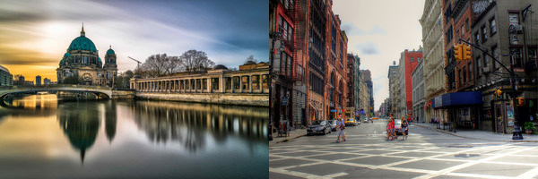
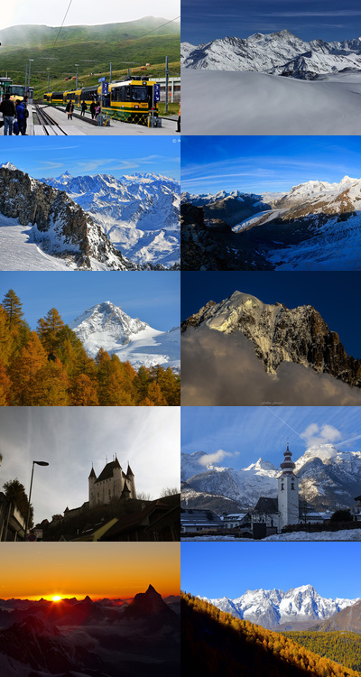

# Flickollage  

A simple command-line tool that accepts a list of words as arguments and generates
a collage grid from ten top-rated images found on Flickr using the provided keywords.

## Installation

You can install Flickollage from rubygems. It requires Ruby version >= 2.0 and
ImageMagick or GraphicsMagick command-line tool.

    $ gem install flickollage

## Flickr access key

You need to provide Flickr access key and shared secret. It can be done using environment
variables `FLICKR_API_KEY` and `FLICKR_SHARED_SECRET` or command-line options
`--flickr-api-key` and `--flickr-shared-secret`.

## Usage

    $ flickollage help generate

It will describe all available options.

    $ flickollage generate -n 2 --rows=1 --cols=2 --width=300 --height=200 Berlin 'New York'

    $ flickollage generate --dict=spec/fixtures/mountains --output mountains.png

